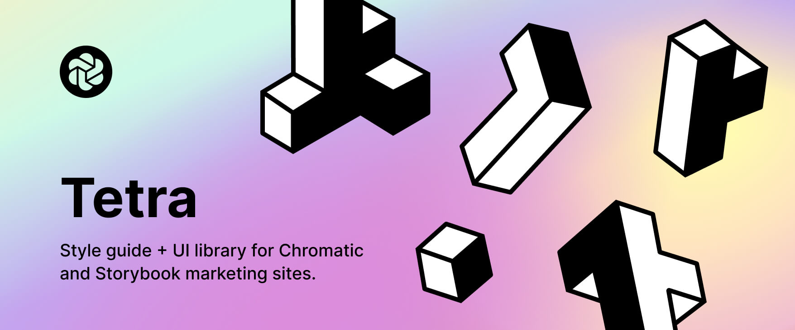

# Tetris



## Install

```bash
npm install --save @chromaui/tetris
```

## Developing

Watch and rebuild code with `tsup` and runs Storybook to preview your UI during development.

```console
yarn storybook
```

## Building

Build package with `tsup` for production.

```console
yarn build
```

## Linking

Often times you want to `link` the package you're developing to another project locally to test it out to circumvent the need to publish it to NPM.

For this we use [yalc](https://github.com/wclr/yalc) which is a tool for local package development and simulating the publishing and installation of packages.

In a project where you want to consume your package simply run:

```console
npx yalc link my-react-package
# or
yarn yalc add my-react-package
```

Learn more about `yalc` [here](https://github.com/wclr/yalc).

## Releasing, tagging & publishing to NPM

Create a semantic version tag and publish to Github Releases. When a new release is detected a Github Action will automatically build the package and publish it to NPM. Additionally, a Storybook will be published to Github pages.

Learn more about how to use the `release-it` command [here](https://github.com/release-it/release-it).

```console
yarn release
```

When you are ready to publish to NPM simply run the following command:

```console
yarn publish
```

## PostCSS

[tsup](https://github.com/egoist/tsup) supports PostCSS out of the box. Simply run `yarn add postcss -D` add a `postcss.config.js` file to the root of your project, then add any plugins you need. Learn more how to configure PostCSS [here](https://tsup.egoist.dev/#css-support).

Additionally consider using the [tsup](https://github.com/egoist/tsup) configuration option `injectStyle` to inject the CSS directly into your Javascript bundle instead of outputting a separate CSS file.
