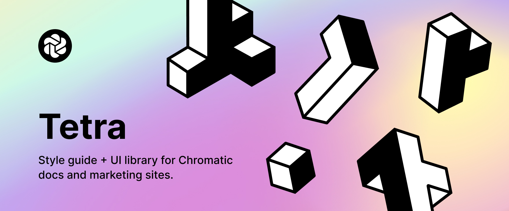

# Tetra ⍜ ⍚



This library centralised Chromatic and Storybooks' style guides as well as an exhaustive list of components use accross our suite of marketing sites. This is also a good excuse to test all the new features that both Storybook and Chromatic offers. Please feel free to learn from it and ask any questions that comes your way.

https://tetra.chromatic.com

## Install

```console
yarn add @chromatic-com/tetra
```

## To Do

- [ ] Replace fonts in Text by the new text helpers
- [ ] Move icons to a new library and import it as primitive inside the Icon component

## Developing

Watch and rebuild code with `tsup` and runs Storybook to preview your UI during development.

```console
yarn storybook
```

## Building

Build package with `tsup` for production.

```console
yarn build
```
